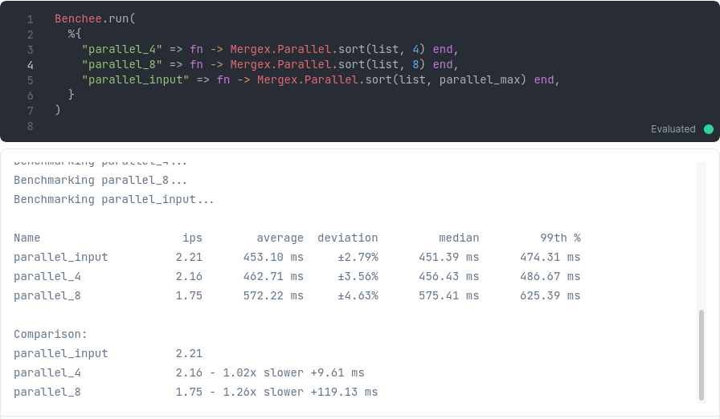
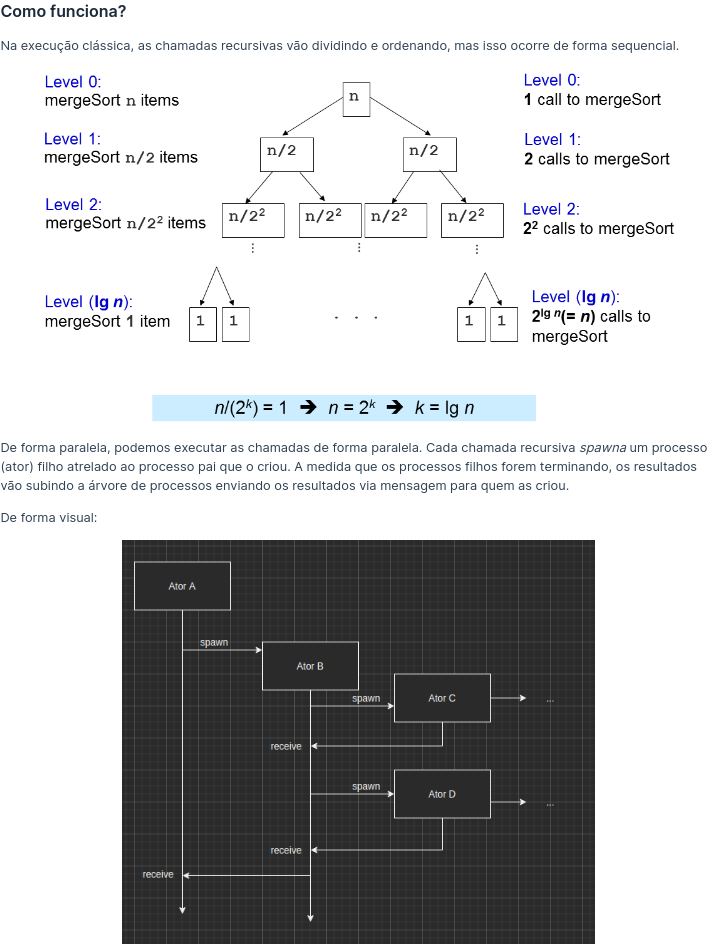
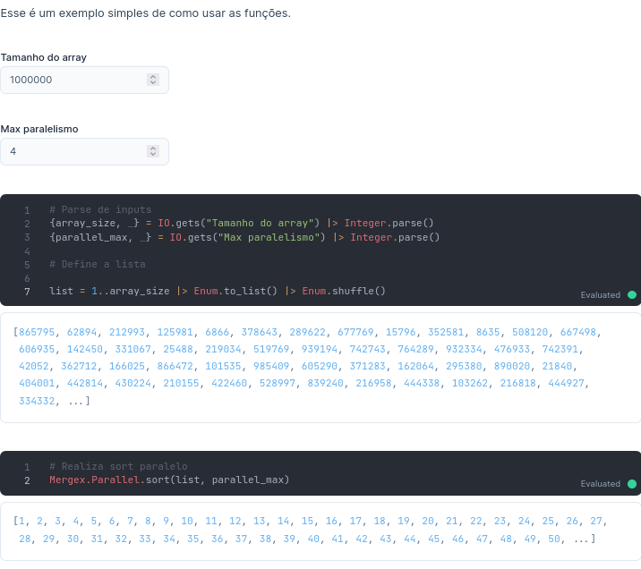

# DC_Mergex

**Número da Lista**: 4
**Conteúdo da Disciplina**: Dividir e Conquistar<br>

## Alunos
|Matrícula | Aluno |
| -- | -- |
| 15/0129807  |  Ícaro Pereira de Oliveira |
| 14/0058371  |  Augusto Moreno Vilarins |

## Sobre 

O objetivo desse trabalho é comparar o ganho de performance de um mergesort sequencial com um mergesort paralelo.

Esse algoritmo de forma distribuída pode ser vantajoso em um modelo de computação distribuída, onde o processamento é dividido em vários nós.

Nesse trabalho, foi utilizada a linguagem Elixir se aproveitando o modelo de concorrencia de atores oferecido pela maquina virtual do Erlang. 

Cada nó é responsável por um bloco de dados, onde cada bloco é dividido em duas partes, ou seja, cada nó é responsável por uma parte do vetor.

Mas, cada nó que vai se dividindo é realizado de forma assíncrona, ou seja, não é necessário esperar que todos os nós sejam finalizados para continuar o processamento.

## Screenshots





## Instalação 
**Linguagem**: Elixir<br>

Descreva os pré-requisitos para rodar o seu projeto e os comandos necessários.

Pré requisitos:

* `Docker`

Para rodar: 

```shell
docker run -p 8080:8080 --pull always -u $(id -u):$(id -g) -v $(pwd):/data livebook/livebook
```

Quando terminar o download e instalação, vai aparecer um log com o endereço, na porta 8080.

Clique no link para abrir o projeto. É importante que o token esteja no link. Senão, vai pedir
um password (que é o token).

Se quiser testar direto no shell, use:

```
docker exec -it livebook_livebook_1 sh
mix run benchmark.exs 100000
```

## Uso 
Explique como usar seu projeto caso haja algum passo a passo após o comando de execução.

## Outros 
Quaisquer outras informações sobre seu projeto podem ser descritas abaixo.